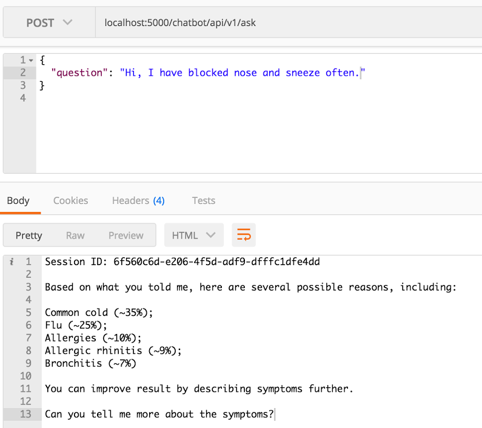

# chatbot
a naive chatbot that sometimes misdiagnoses.

This retrieval-based prototype bot uses publicly available health information to generate indicative diagnosis and link to NHS leaflet. The result is not diagnosis and non-clinical use only.

## Installation
Run `./install.sh`. This will create a virtual environment `venv` and install all components required within.

## Running chatbot
Within virtualenv venv (`source venv/bin/activate`), you can launch separate service:

`python3 -m chatbot.services.ask`

`python3 -m chatbot.services.symptoms`

For the first time running either service, it will take longer than usual as it needs to download, process and cache web data. Afterwards, it takes around 5 minutes to launch `ask` and instantly for `symptoms`.

`export ENGINE=NLTK` to use NLTK backend for traditional Bag of Words model with Naive Bayes
`export ENGINE=TENSORFLOW` to use Tensorflow backend for representational sequence classification with Long-short Term Memroy (LSTM)

## API endpoints
Following endpoints are available to consume:

`POST /chatbot/api/v1/ask`

It accepts payload as simple as `{"questions": "your questions or description of symptoms"}`

`GET /chatbot/api/v1/symptoms`
`GET /chatbot/api/v1/symptoms/<string:symptom_name>`

To list all leaflets or leaflet for the chosen symptom.

## Further development ideas
---Using word vector rather than sparse matrix to extract semantic proximity in embedded space;---

Explore Recurrent Neural Network (e.g. LSTM) to move from retrieval-based model to generative;

---Explore supervised Latent Dirichlet Allocation, RNN as text classification alternative to Naive Bayes.---
